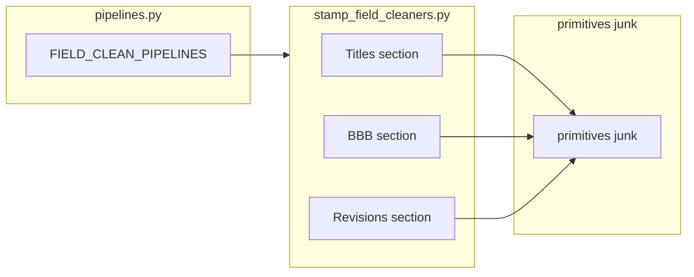

# План: один доменный файл + pipeline doc_title

## Решение по структуре (итерация)

Вместо трёх файлов [`doc_title.py`](pdf_parsing_v2/stamp_text/doc_title.py), [`bbb_sheets.py`](pdf_parsing_v2/stamp_text/bbb_sheets.py), [`revisions.py`](pdf_parsing_v2/stamp_text/revisions.py) — **один модуль**, отражающий общий смысл: *очистка и разбор текстовых полей штампа (не примитивы)*.

### Имя файла (рекомендация)

- **`pdf_parsing_v2/stamp_text/stamp_field_cleaners.py`** — явно «поля штампа», не путается с корневым [`field_cleaners.py`](pdf_parsing_v2/field_cleaners.py) (там только реестр ключей и описания для UI).

В начале файла — краткий module docstring; внутри — **секции-комментарии** для навигации (читается как оглавление):

1. **Titles / document lines** — `doc_title`, `facility_name`, `document_name`, `documentation_type`, `total_number_of_sheets`
2. **BBB sheet numbering** — `sheet_number_6_1`, `sheet_number_6_2`, константы из бывшего `bbb_sheets`
3. **Revisions and stamp metadata** — всё из бывшего `revisions`

Так человек открывает один файл и прыгает по секциям; примитивы и junk по-прежнему в [`primitives.py`](pdf_parsing_v2/stamp_text/primitives.py) / [`junk.py`](pdf_parsing_v2/stamp_text/junk.py).

## Шаблон модуля: эталон форматирования (да — переработка под него)

При реализации **не ограничиваться копипастой** трёх файлов в один: функции привести к **единому виду**, чтобы файл читался как **живой пример** для следующих клинеров.

**Два явных паттерна в одном модуле (и в [`pipelines.py`](pdf_parsing_v2/stamp_text/pipelines.py) рядом):**

| Паттерн | Когда | В доменном модуле | В реестре |
|--------|--------|-------------------|-----------|
| **A — простой** | Один путь, без `parse_warnings` | `def foo(text, ctx) -> str` с кратким docstring | `_wrap(sf.foo)` |
| **B — pipeline** | Strict/relaxed, предупреждения | `def pipeline_foo(text, ctx) -> CleanOutcome` + приватные `_foo_strict` / `_foo_relaxed` / проверки | `sf.pipeline_foo` напрямую |

- Секции: одинаковые **баннеры** (`# --- Section name ---`) и при необходимости 1 строка «что в секции».
- Импорты: вверху модуля один блок `from __future__ import annotations`, затем локальные импорты `stamp_text.*`; **`CleanOutcome` / `ParseWarning`** — только там, где есть pipeline-паттерн (или один раз вверху, если так проще — выбрать единообразно).
- **Эталон паттерна B** — `doc_title`: полный цикл с `clean_tier` и `ParseWarning(tier="relaxed")` по согласованной эвристике «подозрительный жёсткий срез».
- Остальные текущие клинеры остаются паттерном A (без лишнего `CleanOutcome`), но с **выровненными** docstrings и порядком функций по секциям — так в diff видно и «простой», и «полный» образец.

Короткая отсылка в module docstring: контракт уровней см. [`stamp_text/README.md`](pdf_parsing_v2/stamp_text/README.md).

## Реестр

[`pipelines.py`](pdf_parsing_v2/stamp_text/pipelines.py): один импорт домена, например `import stamp_field_cleaners as sf` (или короткий алиас по вкусу), все `_wrap(sf....)` и позже `sf.pipeline_doc_title` для ключа `doc_title`.

## doc_title strict / relaxed

Логика `pipeline_doc_title(text, ctx) -> CleanOutcome` и приватные хелперы живут **в той же секции «Titles»** в `stamp_field_cleaners.py`, сразу под/над функциями того же семейства — без второго файла.

## Затронутые места при мерже

- [`pipelines.py`](pdf_parsing_v2/stamp_text/pipelines.py) — импорт и ссылки на символы
- [`pdf_parsing_v2/test_stamp_text.py`](pdf_parsing_v2/test_stamp_text.py) — заменить `from ... stamp_text import bbb_sheets` на новый модуль
- [`stamp_text/README.md`](pdf_parsing_v2/stamp_text/README.md) — таблица «Структура файлов»
- Удалить три старых файла после переноса (или оставить тонкие shim-файлы с `from ... import *` — **не рекомендуется**, лишний шум; лучше жёсткая замена импортов)

`stamp_text/__init__.py` доменные модули не реэкспортирует — менять не обязательно.

## Verification

- `rg "doc_title|bbb_sheets|revisions" pdf_parsing_v2` — нет битых импортов
- `python -m pytest pdf_parsing_v2/test_stamp_text.py -q` (или существующий смоук по проекту)

## Диаграмма (после мержа)

